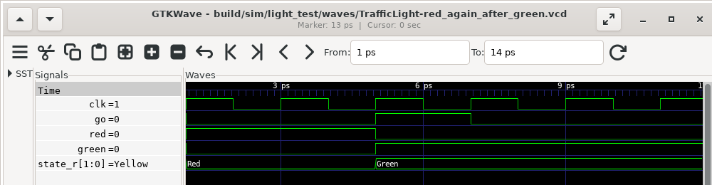

# Tests and waveforms

<div class="chapter-goal">

In this chapter you will run the project's tests, write a state
machine with a test that fails, and follow the failure to a waveform. In
GTKWave the state register shows its state names, not raw bits.

</div>

<div class="before-you-start">

**Before you start**

- **Window:** a terminal ([how to open one](../setup.md#open-a-terminal))
  and your editor.
- **Folder:** the `blinky` project from
  [A project in three commands](new-check-build.md). The previous chapter
  left you in the `cdc` folder, so go back. **Type this:**

  ```console
  cd ~/volt-projects/blinky
  ```

- **Running:** Docker Desktop, with **Engine running** in its window
  ([Setup](../setup.md#install-and-start-docker-desktop) shows how). `volt
  test` runs the Verilator simulator in Docker. You can skip Docker if
  Verilator is installed on your computer: then `volt doctor` shows
  `✓ test, run` without "via Docker".

</div>

The output on this page was recorded with Volt 0.1.0 in PowerShell on
Windows 11, with Docker Desktop running Verilator. On macOS and Linux,
paths are written with `/` instead of `\`.

## Run the tests

The template came with `counter_test.volt`. Check that Docker Desktop says
**Engine running**, then run every test of the project:

**Type this:**

```console
volt test
```

**You should see:**

```text,output
   Compiling counter_test.volt
running 3 tests
note: Verilator not found locally; running it in Docker (verilator/verilator:v5.052)
note: downloading verilator/verilator:v5.052 (~250 MB, first use only; this can take several minutes)
note: downloaded verilator/verilator:v5.052 in 57.3s
test counts_while_enabled ... ok
test holds_while_disabled ... ok
test wraps_to_zero_after_MAX ... ok

cover summary:
  Counter.cov_0 (counter.volt:26)  hit 1 time

test result: ok. 3 passed; 0 failed
```

The two `note:` lines about the download appear once: Volt downloads the
Verilator image the earliest time a test needs it. This run took 70
seconds in total; the next run, with nothing changed, took 3 seconds.

The *cover summary* lists the `cover` lines of the design and how often
the tests reached them. Its line reads:

- `Counter.cov_0`: the module, `Counter`, and the number of the cover in
  that module, counted from 0;
- `(counter.volt:26)`: where the cover is written, line 26 of
  `counter.volt`: `cover: count_r == MAX`;
- `hit 1 time`: in how many clock cycles, over all tests together, the
  condition `count_r == MAX` was true. Here the third test reached 9 once.
  A cover that no test reaches says `NEVER HIT`.

If Docker Desktop is not running, the run stops before any test:

**You should see (if Docker Desktop is not running):**

```text,output
   Compiling counter_test.volt
running 3 tests
error: Verilator not found locally, and Docker is installed but its daemon is not running
  = help: start Docker Desktop (or the docker service) and run the command again; Volt then runs Verilator in a container
```

Start Docker Desktop, wait for **Engine running** and type `volt test`
again.

Here is `counter_test.volt`. Open it in your editor.

**You should see:**

```volt,file=counter_test.volt,from=templates/minimal/counter_test.volt,output
// Simulation tests for Counter. A file named X_test.volt sees the
// modules of X.volt, so counter.volt is loaded automatically.
//
// `let dut = Counter { }` instantiates the design with its reset
// applied; `dut.<input> = value` drives an input, step(n) advances the
// clock n cycles, and assert_eq / assert_true / assert_false check
// outputs.

test "counts while enabled" {
    let dut = Counter { };
    dut.enable = true;
    step(3);
    assert_eq(dut.count, 3);
}

test "holds while disabled" {
    let dut = Counter { };
    dut.enable = true;
    step(2);
    dut.enable = false;
    step(5);
    assert_eq(dut.count, 2);
}

test "wraps to zero after MAX" {
    let dut = Counter { };
    dut.enable = true;
    step(9);
    assert_eq(dut.count, 9);
    assert_true(dut.wrap);
    step(1);
    assert_eq(dut.count, 0);
    assert_false(dut.wrap);
}
```

`Counter { }` creates the design with its reset applied, `dut.enable =
true` drives an input, `step(3)` advances the clock three cycles and
`assert_eq` checks an output.

<div class="box new-to-hw">

**New to hardware?** What a test does to a circuit

A software test calls a function and looks at the result. A hardware test
sets input wires, lets the clock tick a number of times, and then looks at
the output wires. Between two ticks nothing happens: every register holds
its value. `step(n)` is "let n clock ticks pass".

</div>

## A state machine

Add a traffic light to the project. In the `blinky` folder, next to
`counter.volt`:

**Create this file:** `light.volt` ([how](../setup.md#create-a-file))

```volt,file=light.volt
// A traffic light. `go` starts a cycle: green for four clock
// cycles, yellow for one, then red again until the next `go`.

const GREEN_CYCLES : u4 = 4

enum Light { Red, Green, Yellow }

pub module TrafficLight {
    in  clk   : clock
    in  go    : bool
    out red   : bool
    out green : bool

    reg state_r : Light = Light::Red
    reg timer_r : u4    = 0

    on clk {
        match state_r {
            Light::Red => {
                if go {
                    state_r <= Light::Green
                }
            }
            Light::Green => {
                if timer_r == GREEN_CYCLES - 1 {
                    timer_r <= 0
                    state_r <= Light::Yellow
                } else {
                    timer_r <= timer_r + 1
                }
            }
            Light::Yellow => {
                state_r <= Light::Red
            }
        }
    }

    red   = state_r == Light::Red
    green = state_r == Light::Green
}
```

`enum Light` lists the states, and `match` says what each state does at
the clock edge. Volt checks that every state has an arm.

Now a test file with two tests. The second one expects the light to be
red again four cycles after it turned green:

**Create this file:** `light_test.volt`

```volt,file=light_test.volt,test_fails
// Simulation tests for TrafficLight.

test "go turns the light green" {
    let dut = TrafficLight { };
    dut.go = true;
    step(1);
    dut.go = false;
    assert_true(dut.green);
}

test "red again after green" {
    let dut = TrafficLight { };
    dut.go = true;
    step(1);
    dut.go = false;
    step(4);
    assert_true(dut.red);
}
```

A file named `X_test.volt` sees the modules of `X.volt`, so the test finds
`TrafficLight` by itself.

## A failing test

**Type this:**

```console
volt test
```

**You should see:**

```text,output
   Compiling counter_test.volt
   Compiling light_test.volt
running 5 tests
note: Verilator not found locally; running it in Docker (verilator/verilator:v5.052)
test counts_while_enabled ... ok
test holds_while_disabled ... ok
test wraps_to_zero_after_MAX ... ok
test go_turns_the_light_green ... ok
test red_again_after_green ... FAILED
   Recording waveform of 1 failed test(s) of TrafficLight

failures:
---- red_again_after_green ----
  assert_true failed at light_test.volt:17
    value: 0
  Waveform gtkwave build\sim\light_test\waves\TrafficLight-red_again_after_green.vcd build\sim\light_test\waves\TrafficLight-red_again_after_green.gtkw

cover summary:
  Counter.cov_0 (counter.volt:26)                          hit 1 time
  TrafficLight.cov_0 (light.volt:21, auto FSM transition)  hit 2 times
  TrafficLight.cov_1 (light.volt:27, auto FSM transition)  hit 1 time
  TrafficLight.cov_2 (light.volt:33, auto FSM transition)  NEVER HIT
  TrafficLight.cov_3 (light.volt:25, auto counter wrap)    hit 1 time

test result: FAILED. 4 passed; 1 failed
```

The light was not red at line 17 of the test. Volt ran the failed test once
more with tracing on and wrote its waveform; the `Waveform` line is the
command that opens it.

The cover summary has new lines. `light.volt` has no `cover` line of its
own; these are covers that Volt added, marked `auto`: one for every transition of
the state machine (`auto FSM transition`, at the line that changes the
state) and one for the timer's wrap (`auto counter wrap`). `cov_0`, the
step from red to green at line 21, is hit twice: once in each test.
`cov_2`, the step from yellow back to red at line 33, reads `NEVER HIT`:
no test reaches it. A cover that is never hit often points to a missing
or wrong test, as here.

## Read the waveform

A waveform shows every signal of the design over time. Install GTKWave
(Linux: your package manager, for example `sudo apt install gtkwave`;
Windows and macOS: GTKWave is part of the
[OSS CAD Suite](https://github.com/YosysHQ/oss-cad-suite-build)), then run
the `Waveform` command **from the `blinky` folder**, where you ran `volt
test`. The command is the `Waveform` line that `volt test` printed; copy
it from your terminal ([how](../setup.md#copy-what-a-command-printed)) or
from here.

**Type this (Windows, PowerShell):**

```powershell
gtkwave build\sim\light_test\waves\TrafficLight-red_again_after_green.vcd build\sim\light_test\waves\TrafficLight-red_again_after_green.gtkw
```

**Type this (macOS and Linux):**

```sh
gtkwave build/sim/light_test/waves/TrafficLight-red_again_after_green.vcd build/sim/light_test/waves/TrafficLight-red_again_after_green.gtkw
```

GTKWave opens a window of its own.



The screenshot was taken with GTKWave 3.3.116 on Linux, with the marker
placed at the end of the test. The `.gtkw` session file lists the ports of
the tested module and the state register `state_r`. A waveform file has no
notion of an enum, so the session also carries a table from each code to
its name: `state_r` reads `Red`, `Green` and `Yellow` instead of `00`,
`01`, `10`.

At the end of the test, `state_r` is `Yellow`, not `Red`. The design
spends four cycles in green and one in yellow; the test forgot the yellow
cycle. The design is right and the test is wrong. Change `step(4)` to
`step(5)` in the second test:

**Replace this file:** `light_test.volt`

```volt,file=light_test.volt
// Simulation tests for TrafficLight.

test "go turns the light green" {
    let dut = TrafficLight { };
    dut.go = true;
    step(1);
    dut.go = false;
    assert_true(dut.green);
}

test "red again after green" {
    let dut = TrafficLight { };
    dut.go = true;
    step(1);
    dut.go = false;
    step(5);
    assert_true(dut.red);
}
```

Save the file and run the tests again:

**Type this:**

```console
volt test
```

**You should see:**

```text,output
   Compiling counter_test.volt
   Compiling light_test.volt
running 5 tests
note: Verilator not found locally; running it in Docker (verilator/verilator:v5.052)
test counts_while_enabled ... ok
test holds_while_disabled ... ok
test wraps_to_zero_after_MAX ... ok
test go_turns_the_light_green ... ok
test red_again_after_green ... ok

cover summary:
  Counter.cov_0 (counter.volt:26)                          hit 1 time
  TrafficLight.cov_0 (light.volt:21, auto FSM transition)  hit 2 times
  TrafficLight.cov_1 (light.volt:27, auto FSM transition)  hit 1 time
  TrafficLight.cov_2 (light.volt:33, auto FSM transition)  hit 1 time
  TrafficLight.cov_3 (light.volt:25, auto counter wrap)    hit 1 time

test result: ok. 5 passed; 0 failed
```

All tests pass. `volt test --watch` runs them again every time you save a
file.

<div class="box from-sv">

**Coming from SystemVerilog?** Tests without a testbench file

A Volt `test` block compiles to a C++ Verilator testbench: `step()` toggles
every clock of the design, reset is applied before the test body, and the
contracts of the design run as monitors on every cycle. There is no `initial` block, no `#delay` and no
UVM. A passing run records no waveform, so it costs nothing; `volt test
--waves` records every test. The `.gtkw` file and the translate tables are
extra files next to the VCD; the generated SystemVerilog does not change.

</div>

Next: [what we learned](recap.md).
